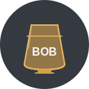

# Bob the Whisky Expert

Bob the Whisky Expert is an AI-powered whisky recommendation platform that provides personalized bottle suggestions through advanced machine learning algorithms and interactive user experiences.



## Features

- **Personal Whisky Recommendations**: Analyzes user whisky collection to provide tailored bottle suggestions
- **Advanced Recommendation Engine**: Uses collaborative filtering and preference analysis
- **Interactive Chat**: Talk directly with "Bob" about whisky recommendations and questions
- **BAXUS Integration**: Connects with the BAXUS API to fetch user collection data
- **Detailed Flavor Profiles**: Visual representation of whisky flavor characteristics
- **Price Analysis**: Recommendations based on your typical spending patterns

## Installation

For detailed installation instructions, please see [INSTALLATION.md](INSTALLATION.md).

### Quick Start

1. Clone the repository
2. Install required Python packages (see INSTALLATION.md for a complete list)
3. Create a `.env` file with your OpenAI API key
4. Run `python main.py`

### API Keys

You will need an OpenAI API key for the chat functionality. 
Add this to your `.env` file as:

```
OPENAI_API_KEY=your_openai_api_key_here
```

## Usage

### Running the Application

1. **Start the Flask server**

```bash
python main.py
```

Alternatively, use gunicorn (recommended for production):

```bash
gunicorn --bind 0.0.0.0:5000 --reuse-port --reload main:app
```

2. **Access the application**

Open your web browser and navigate to:
```
http://localhost:5000
```

### Using the Application

For detailed usage instructions, please see [USAGE.md](USAGE.md).

1. **Enter your BAXUS username**
   - On the home page, enter your BAXUS username to access your personalized recommendations
   - The app will analyze your existing whisky collection stored in BAXUS

2. **Viewing recommendations**
   - Browse personalized whisky recommendations based on your collection
   - Each recommendation includes detailed information about the bottle, including flavor profile, price, and region

3. **Chat with Bob**
   - Use the chat widget on the recommendations page to interact with Bob
   - Ask questions about specific whiskies, regions, or flavor preferences
   - Request recommendations for specific occasions or price ranges

## Development

### Project Structure

- `main.py`: Application entry point
- `app.py`: Flask application with routes and controllers
- `bob_chat.py`: Implementation of the Bob AI assistant
- `bottle_dataset.py`: Whisky bottle dataset access
- `recommendation_engine.py`: Machine learning recommendation algorithms
- `models.py`: Data models for bottles and user preferences
- `baxus_api.py`: Integration with BAXUS API
- `static/`: Static assets (CSS, JavaScript, images)
- `templates/`: HTML templates
- `.env`: Environment variables (not included in repository)

### Environment Variables

- `OPENAI_API_KEY`: Required for the chat functionality
- `FLASK_ENV`: Set to 'development' or 'production'
- `FLASK_DEBUG`: Set to 'True' for development
- `SECRET_KEY`: Flask secret key for securing sessions
- `SESSION_SECRET`: Session security key

## License

[MIT License](LICENSE)

## Acknowledgments

- Built with Flask, OpenAI API, and Bootstrap
- Uses the BAXUS API for collection data
- Whisky dataset includes comprehensive bottle information